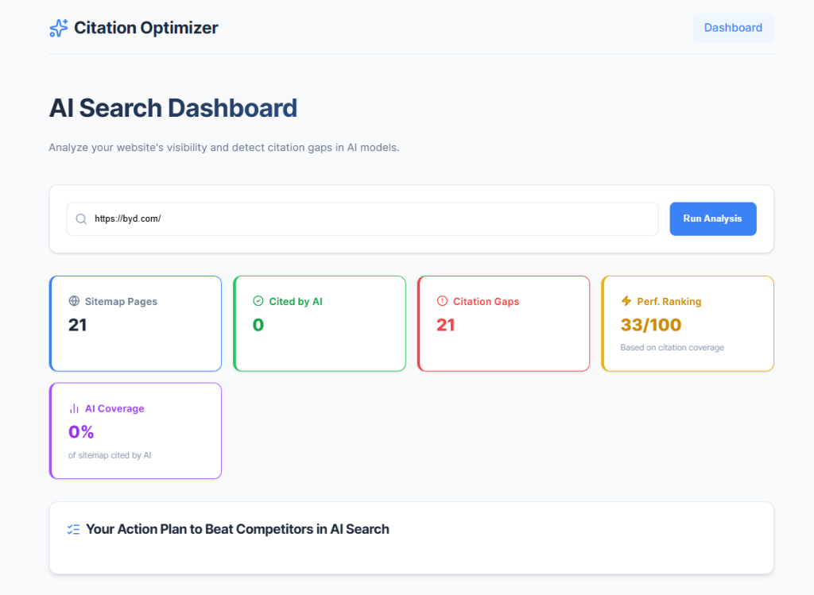
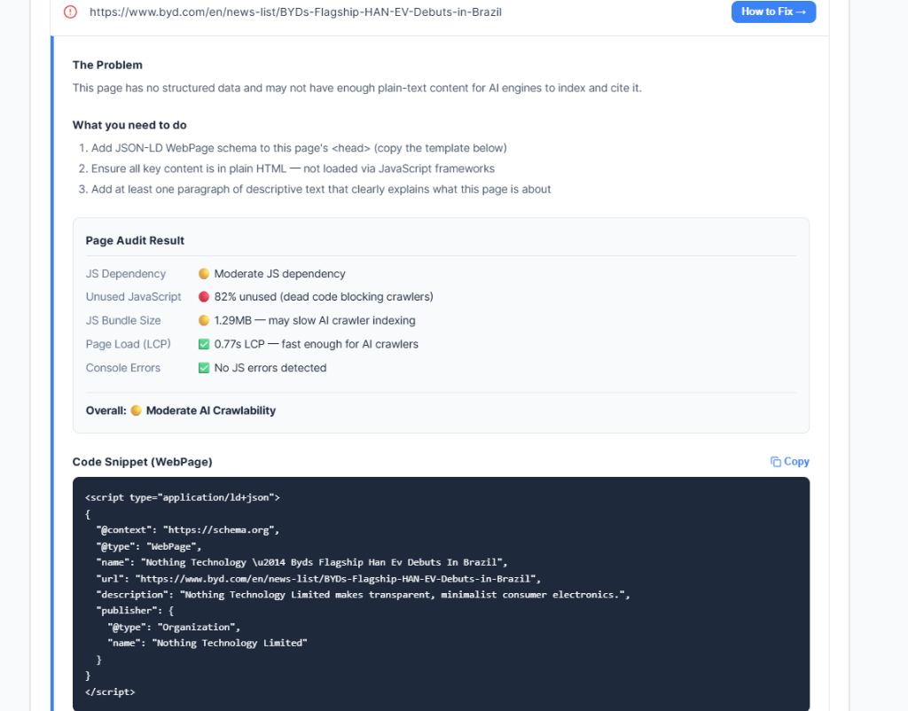
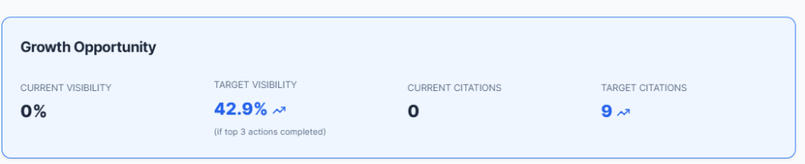

# AI Citation Optimizer

AI Citation Optimizer helps early-stage brands like Nothing Phone, Attio, and BYD close the AI search visibility gap against Apple, Salesforce, and Tesla — built on top of Peec AI's MCP to turn monitoring data into automated action.







## Key Features

- **Competitor Advantage Breakdown:** Visualizes visibility gaps between your brand and top competitors across YouTube, Reddit, Editorial Lists, and Wikipedia.
- **Detailed Optimization Roadmap:** A prioritized action plan generated from your domain's AI citation gaps.
- **Automated Content Drafting:** Uses Gemini to instantly draft tailored YouTube collaboration pitches, Reddit comments, and PR emails.
- **Actionable Fix Instructions:** Provides specific problem analysis, step-by-step fixes, and copy-paste JSON-LD schema snippets for missing pages based on URL structures.
- **Deep Technical Audit:** Simulates an AI indexer using a Headless Chromium instance (via Playwright & CDP) to capture and analyze precise technical layers (Unused JS, Bundle Size, DOM depth, Console Errors) that AI bots struggle with.

## How We Measure & Optimize for AI Crawlers

Unlike traditional search engines, AI search bots (like ChatGPT-Search, Perplexity, and Gemini) have much stricter timeouts and struggle with heavy client-side rendering. To help websites win in the AI era, our solution measures performance across several strict technical layers and prescribes targeted fixes.

### 1. The Measurement Layers (Playwright + CDP)

When you audit a URL, our backend spins up a Headless Chromium browser and attaches via the Chrome DevTools Protocol (CDP) to measure exact AI-crawler blockers:

- **JS Dependency & Bloat:** We measure the delta between raw HTML length and fully rendered text. High JS dependency means AI bots might only see a blank page.
- **Unused JavaScript (Dead Code):** We use CDP precise coverage traces to determine what percentage of downloaded JS functions are actually executed. Dead code wastes the crawler's strict execution budget.
- **JS Bundle Payload Size:** Tracks the exact weight of downloaded JavaScript. Heavy bundles cause AI crawlers to time out before indexing the content.
- **Largest Contentful Paint (LCP):** Evaluates how fast the main content renders for the bot.
- **Console Errors:** Traps live JS errors during the render phase, which often completely break an AI bot's ability to "see" the page.
- **Structured Data (JSON-LD):** Detects if semantic markup exists to feed the LLM easily digestible context.

### 2. The Improvement Layers (Actionable Fixes)

Instead of just showing raw data, the tool turns these metrics into immediate action:

- **Guide-First Action Plans:** We use `gemini-2.5-flash` to evaluate the metrics and output a prioritized checklist of what developers need to fix.
- **Copy-Paste Schema Generation:** If a page is missing context, the app generates custom JSON-LD (e.g., `Product`, `FAQPage`, or `Article`) explicitly tailored to the page's URL path.
- **Off-Page Strategy:** The dashboard identifies gaps across external channels (Reddit, YouTube) and automatically drafts outreach content to help your brand get cited externally.

## Architecture

- **Backend**: FastAPI (Python 3.11+)
- **AI Agent**: Playwright (for rendered HTML analysis) + Gemini 2.5 Flash
- **Data Provider**: Peec AI API (for citation metrics and domain visibility)
- **Frontend**: React + Vite (Vanilla CSS Premium Design)

## Setup Instructions

### 1. Environment Variables

Create a `.env` file in the root directory (based on `.env.example`):

```env
PEEC_API_KEY=your_peec_api_key
GEMINI_API_KEY=your_gemini_api_key
```

---

## 🐳 Running with Docker (Recommended)

Docker is the easiest way to run the app as it pre-configures all Playwright browser dependencies.

### Run everything with Docker Compose

```bash
# Build and start both services
docker-compose up --build

# Start in background
docker-compose up -d

# Stop services
docker-compose down
```

### Build & Run Individual Containers (Optional)

**Backend:**

```bash
cd backend
docker build -t ai-citation-backend .
docker run -p 8000:8000 --env-file ../.env ai-citation-backend
```

**Frontend:**

```bash
cd frontend
docker build -t ai-citation-frontend .
docker run -p 5173:5173 ai-citation-frontend
```

---

## 🛠️ Running without Docker (Manual)

### 1. Backend Setup

```bash
cd backend
python -m venv venv
source venv/bin/activate  # On Windows: venv\Scripts\activate
pip install -r requirements.txt
python -m playwright install chromium
```

### 2. Frontend Setup

```bash
cd frontend
npm install
```

### 3. Start the Application

**Start Backend:**

```bash
cd backend
uvicorn app.main:app --reload --port 8000
```

**Start Frontend:**

```bash
cd frontend
npm run dev
```

---

## API Endpoints

- `GET /api/gaps?domain=<domain>`: Returns a list of non-cited pages, overall performance metrics, and competitor visibility data.
- `GET /api/benchmark?domain=<domain>`: Provides the detailed optimization roadmap, competitor breakdown, and gap sources.
- `POST /api/audit`: Conducts a deep crawlability and AI-readiness audit of a specific URL.
- `POST /api/generate-fix`: Generates an actionable fix checklist and JSON-LD schema for a missing page.
- `POST /api/generate-content`: Drafts targeted outreach content (emails, comments, scripts) for specific optimization roadmap items.

## Example Usage

1. Enter your domain (e.g., `nothing.tech`) on the Dashboard.
2. Review the **Growth Opportunity** and **Competitor Advantage Breakdown** to see where you stand. (Note: Estimated progress in a realistic benchmark shows around 50% improvement for targeted businesses).
3. Check the **Optimization Roadmap** for high-priority actions and click "Draft Content" to instantly generate outreach emails or comments.
4. Drill down into specific **Gap Sources** (YouTube, Reddit, Editorial) to identify missed citation opportunities.
5. In the **Pages Missing** section, click "How to Fix" to get specific, step-by-step instructions and JSON-LD markup to make the page AI-ready.
