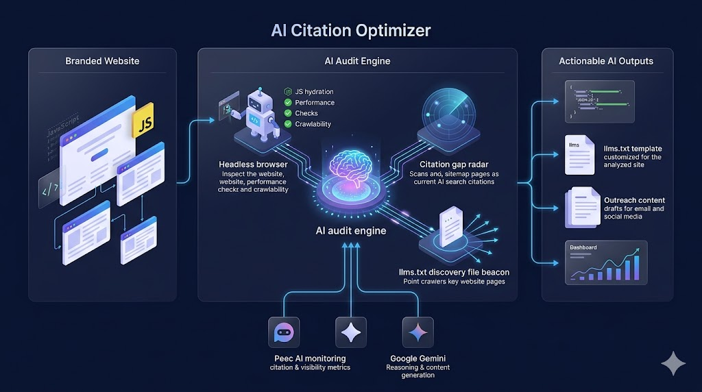

# AI Citation Optimizer

AI Citation Optimizer helps early-stage brands like Nothing Phone, Attio, and BYD close the AI search visibility gap against Apple, Salesforce, and Tesla — built on top of Peec AI's MCP to turn monitoring data into automated action.


## Key Features

- **Deep Technical AI Audit:** Simulates an AI indexer using a Headless Chromium instance (via Playwright & CDP) to capture and analyze precise technical layers—like Unused JS, JS-to-Text ratio, and DOM depth—that specifically cause AI search bots to fail or time out.
- **Automated Sitemap-to-Citation Mapping:** Instantly identifies the "Discovery Gap" by cross-referencing your sitemap against real-time AI citations, revealing exactly which high-value pages are being ignored by LLM crawlers.
- **Actionable AI-Readiness Fixes:** Provides step-by-step technical instructions, generated copy-paste JSON-LD schema snippets, and **llms.txt templates** for the analyzed site to improve AI discovery and LLM ingestion.
- **Instant Outreach Content Drafting:** Uses Gemini to draft tailored collaboration pitches, Reddit comments, and PR emails for specific gaps identified in your optimization roadmap.
- **Dynamic Growth Projection:** Uses a realistic 50% recovery model to project visibility and citation growth based on technical gap closure and off-page strategic actions.

## How We Measure & Optimize for AI Crawlers

Unlike traditional search engines, AI search bots (like ChatGPT-Search, Perplexity, and Gemini) have much stricter timeouts and struggle with heavy client-side rendering. Our tool identifies these blockers through a **Technical Health Matrix** and prescribes targeted fixes.

### 1. The Measurement Layers (Playwright + CDP)

When you audit a URL, our backend spins up a Headless Chromium browser and attaches via the Chrome DevTools Protocol (CDP) to measure exact AI-crawler blockers:

- **JS Dependency & Bloat:** We measure the delta between raw HTML length and fully rendered text. High JS dependency means AI bots might only see a blank page.
- **Unused JavaScript (Dead Code):** We use CDP precise coverage traces to determine what percentage of downloaded JS functions are actually executed. Dead code wastes the crawler's strict execution budget.
- **JS Bundle Payload Size:** Tracks the exact weight of downloaded JavaScript. Heavy bundles cause AI crawlers to time out before indexing the content.
- **Largest Contentful Paint (LCP):** Evaluates how fast the main content renders for the bot.
- **Console Errors:** Traps live JS errors during the render phase, which often completely break an AI bot's ability to "see" the page.
- **Structured Data (JSON-LD):** Detects if semantic markup exists to feed the LLM easily digestible context.
- **LLM Discovery File (llms.txt):** Probes the analyzed domain for `/llms.txt` in parallel with the browser audit and checks whether the page is listed in the site's curated AI index ([llmstxt.org](https://llmstxt.org/) spec).

### 2. The Improvement Layers (Actionable Fixes)

Instead of just showing raw data, the tool turns these metrics into immediate action:

- **Unified Action Plan:** Every audit generates a single, comprehensive "General Chromium Optimization Tips" section. This provides a framework-agnostic implementation plan to solve all flagged technical issues (JS bloat, LCP, console errors) in one centralized view.
- **Deep Technical Health Matrix:** Replaces generic scores with a detailed list of bot-centric metrics, including JS Hydration impact, Unused JS coverage, LCP, and **llms.txt status**, with explicit 🔴/🟡/✅ status indicators.
- **Copy-Paste Schema Generation:** Automatically generates custom JSON-LD (e.g., `Product`, `Organization`) tailored to the specific URL path to accelerate AI entity recognition.
- **llms.txt Template Generation:** When the analyzed site lacks `/llms.txt` or does not list the page, generates a ready-to-deploy markdown file for `https://your-domain/llms.txt`.

## Architecture



- **Backend**: FastAPI (Python 3.11+)
- **AI Orchestration**: LangChain (for structured chains and prompt templates)
- **AI Agent**: Playwright (for rendered HTML analysis) + Gemini 2.5 Flash
- **Data Provider**: Peec AI API (for citation metrics and domain visibility)
- **Frontend**: React + Vite + pnpm (Tailwind CSS)
- **Code Quality**: Integrated Linters for both Backend and Frontend
- **Progress Tracking**: Dynamic visibility progress visualization at the top of the dashboard

## Getting Started

### 1. API keys

Copy the example env file and add your keys:

```bash
cp .env.example .env          # macOS, WSL, Git Bash
```

```powershell
Copy-Item .env.example .env   # Windows PowerShell
```

```env
GEMINI_API_KEY=your_gemini_api_key
PEEC_API_KEY=your_peec_api_key   # optional — Peec features hide if missing or invalid
```

### 2. Choose how to run the app

| Where you work | Easiest command | Notes |
|----------------|-----------------|-------|
| **Windows PowerShell** | `docker compose up --build` | Same as before — use your Windows project folder |
| **WSL Ubuntu (first time)** | `npm run setup` then `npm run dev` | No Docker permissions needed |
| **WSL Ubuntu (with Docker)** | `docker compose up --build` | One-time fix below, then same as Windows |
| **macOS** | `npm run setup` then `npm run dev` | Or Docker Desktop |

**App URL:** [http://localhost:5173](http://localhost:5173)  
**API docs:** [http://localhost:8000/docs](http://localhost:8000/docs)

---

## Windows (PowerShell)

If the app already worked on Windows, keep using PowerShell — nothing special required.

```powershell
cd C:\path\to\ai-citation-optimizer
Copy-Item .env.example .env   # first time only — add your API keys

# With Docker (recommended)
docker compose up --build

# Without Docker
npm run setup
npm run dev
```

---

## WSL Ubuntu (first time)

WSL is a separate Linux environment from Windows. The app is the same; only the setup differs.

### Fastest way (no Docker)

```bash
cd ~/projects/ai-citation-optimizer
cp .env.example .env          # add your API keys
npm run setup                 # first time only
npm run dev
```

Open [http://localhost:5173](http://localhost:5173)

### With Docker

1. **Docker Desktop must be running on Windows**
2. Enable **Settings → Resources → WSL Integration → Ubuntu**
3. **One-time permission fix** in Ubuntu (even after enabling integration):

```bash
sudo usermod -aG docker $USER
```

4. **Close Ubuntu and reopen it** (or run `wsl --shutdown` in PowerShell, then reopen)
5. Start the app:

```bash
cd ~/projects/ai-citation-optimizer
docker compose up --build
```

**Verify Docker works:**

```bash
groups        # should list "docker"
docker ps
```

**If Docker still fails:** use `npm run dev` instead — the app works fine without Docker.

---

## macOS

```bash
brew install node python@3.12   # if needed
cp .env.example .env
npm run setup
npm run dev
```

Or with Docker Desktop: `docker compose up --build`

---

## All commands (reference)

```bash
npm run setup              # install Python + pnpm deps (first time)
npm run dev                # start backend + frontend together
npm run test               # run backend + frontend tests (unit/integration)
npm run test:backend:integration  # Playwright browser test (optional)
npm run docker:up          # docker compose up --build
npm run docker:down        # docker compose down
```

### Tests

```bash
npm run test                      # all unit + API integration tests
npm run test:backend              # pytest only (skips Playwright by default)
npm run test:frontend             # vitest only
npm run typecheck                 # strict TypeScript (frontend)
npm run test:backend:integration  # Playwright audit on react.dev (needs Chromium)
npm run validate                  # lint + typecheck + test (same as pre-commit hook)
```

Backend tests use **pytest** with mocked Peec/sitemap/agent dependencies. The Playwright test is marked `integration` and excluded from the default run.

### Pre-commit hook

After `npm run setup`, every `git commit` automatically runs:

1. Backend lint (`ruff check` + `ruff format --check`)
2. Frontend typecheck (`tsc --noEmit`)
3. Frontend lint (`eslint`)
4. Backend unit tests (`pytest`, integration excluded)
5. Frontend tests (`vitest run`)

To run the same checks manually: `npm run validate`

To skip once (not recommended): `git commit --no-verify`

**Manual start (two terminals):**

```bash
# Terminal 1 — backend
cd backend && source .venv/bin/activate    # WSL/macOS
uvicorn app.main:app --reload --port 8000

# Terminal 2 — frontend
cd frontend && pnpm dev
```

Windows backend activation: `.\.venv\Scripts\Activate.ps1`

---

## API Endpoints

- `GET /api/gaps?domain=<domain>`: Returns a list of non-cited pages, overall performance metrics, and competitor visibility data.
- `GET /api/benchmark?domain=<domain>`: Provides the detailed optimization roadmap, competitor breakdown, and gap sources.
- `POST /api/audit`: Conducts a deep crawlability and AI-readiness audit of a specific URL.
- `POST /api/generate-fix`: Generates an actionable fix checklist, JSON-LD schema, live Playwright metrics, and an **llms.txt template** for the analyzed site.
- `POST /api/generate-content`: Drafts targeted outreach content (emails, comments, scripts) for specific optimization roadmap items.

## Example Usage

1. Enter your domain (e.g., `nothing.tech`) on the Dashboard.
2. Review the **Growth Opportunity** and **Competitor Advantage Breakdown** to see where you stand. (Note: Estimated progress in a realistic benchmark shows around 50% improvement for targeted businesses).
3. Check the **Optimization Roadmap** for high-priority actions and click "Draft Content" to instantly generate outreach emails or comments.
4. Drill down into specific **Gap Sources** (YouTube, Reddit, Editorial) to identify missed citation opportunities.
5. In the **Pages Missing** section, click "How to Fix" to get step-by-step instructions, live JS performance metrics, and an **llms.txt template** to publish on the analyzed domain. Use the expandable guidance buttons for framework-agnostic fixes. Open **View Deep Technical Audit Report** for the full signal breakdown.

## Developer Docs

Compact reference docs for contributors and AI coding agents (start with `docs/AGENT_CONTEXT.md`):

- [`docs/AGENT_CONTEXT.md`](docs/AGENT_CONTEXT.md) — file map and key symbols (token-optimized)
- [`docs/ARCHITECTURE.md`](docs/ARCHITECTURE.md) — system design and data flows
- [`docs/JS_CITATION_AUDIT.md`](docs/JS_CITATION_AUDIT.md) — Playwright JS metrics and thresholds
- [`docs/LLMS_TXT_INTEGRATION.md`](docs/LLMS_TXT_INTEGRATION.md) — llms.txt probe, guidance, and UI
