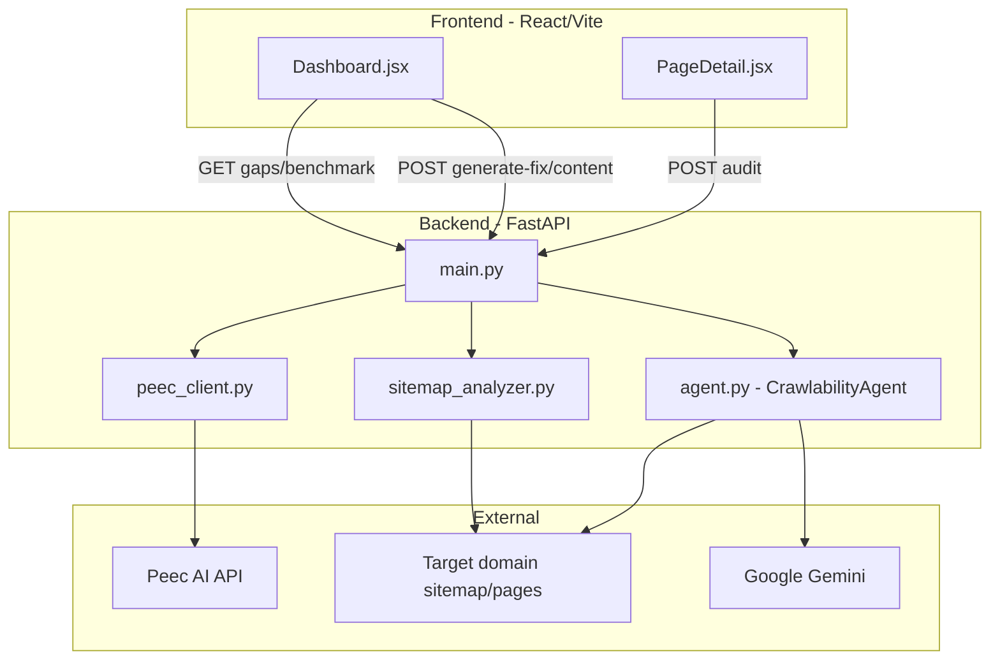

# Architecture

## System diagram

## Module responsibilities

### `backend/app/main.py`

- FastAPI app, CORS `*`
- `PROJECT_MAP`: domain → Peec project ID
- Orchestrates all endpoints; no business logic beyond aggregation

### `backend/app/agent.py` — `CrawlabilityAgent`

| Method | Purpose |
|--------|---------|
| `build_fix_instructions(url)` | URL-path rules → problem, checklist, JSON-LD template |
| `fetch_and_analyze(url, skip_ai)` | Playwright audit; optional Gemini reasoning |
| `_generate_guidance(signals)` | Action steps for flagged metrics |
| `generate_action_content(type, text)` | Gemini outreach copy |
| `audit_url(url)` | Alias for full analyze |

### `backend/app/sitemap_analyzer.py`

- `fetch_sitemap_urls(domain)` → `{urls, metrics}` (tries `/sitemap.xml`, index, `/en/sitemap.xml`)
- `get_ai_citation_gaps(sitemap, cited)` → `(gaps, orphans)`

### `backend/app/peec_client.py`

- Cached Peec customer API client: reports, brands, actions, cited URLs

### Frontend pages

| Page | Role |
|------|------|
| `Dashboard.jsx` | Domain input, gaps list, benchmark, "How to Fix" panel with Technical Health Matrix |
| `PageDetail.jsx` | Single-URL deep audit report |

## Audit phases (Playwright)

1. **Raw HTML probe** — httpx + BeautifulSoup → `raw_text_length`
2. **Browser render** — Chromium headless:
   - Console errors (`pageerror`)
   - JS payload (response `content-type: javascript`)
   - Unused JS (CDP `Profiler.startPreciseCoverage`)
   - LCP (PerformanceObserver)
   - Rendered text → `text_delta`, `js_impact`
   - JSON-LD presence, DOM depth
3. **AI reasoning** (unless `skip_ai=True`) — Gemini structured JSON audit

## Extension points

Same pattern for new AI-readiness checks:

1. Probe in `sitemap_analyzer.py` or `fetch_and_analyze`
2. Signal key in `signals` dict
3. Guidance block in `_generate_guidance`
4. Fix template in `build_fix_instructions`
5. UI row in `Dashboard.jsx` Technical Health Matrix
6. Optional API field in `/api/gaps` site-level metrics

`llms.txt` follows this pattern — see `docs/LLMS_TXT_INTEGRATION.md`.
