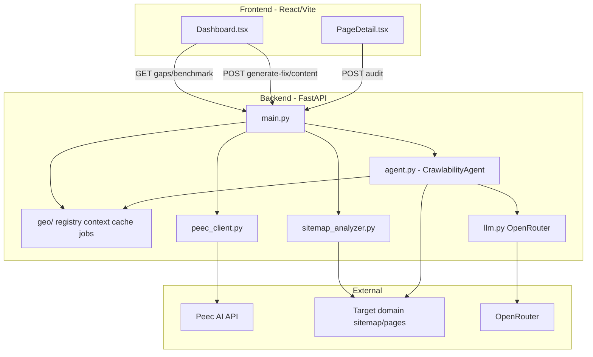

# Architecture

## System diagram

```mermaid
flowchart TB
    subgraph frontend [Frontend - React/Vite]
        D[Dashboard.tsx]
        P[PageDetail.tsx]
    end

    subgraph backend [Backend - FastAPI]
        M[main.py]
        A[agent.py - CrawlabilityAgent]
        G[geo/ registry context cache jobs]
        S[sitemap_analyzer.py]
        PC[peec_client.py]
        L[llm.py OpenRouter]
    end

    subgraph external [External]
        Peec[Peec AI API]
        Site[Target domain sitemap/pages]
        OpenRouter[OpenRouter]
    end

    D -->|GET gaps/benchmark| M
    D -->|POST generate-fix/content| M
    P -->|POST audit| M
    M --> S
    M --> PC
    M --> A
    M --> G
    A --> G
    A --> L
    S --> Site
    PC --> Peec
    A --> Site
    L --> OpenRouter
```

## Module responsibilities

### `backend/app/main.py`

- FastAPI app, CORS `*`
- `PROJECT_MAP`: domain → Peec project ID
- Orchestrates all endpoints; no business logic beyond aggregation

### `backend/app/agent.py` — `CrawlabilityAgent`

| Method | Purpose |
|--------|---------|
| `build_fix_instructions(url)` | URL-path rules → problem, checklist, JSON-LD template |
| `fetch_and_analyze(url, skip_ai)` | Playwright audit; optional OpenRouter reasoning; fast GEO checks |
| `_generate_guidance(signals)` | Action steps for flagged metrics |
| `generate_action_content(type, text)` | OpenRouter outreach copy |
| `audit_url(url)` | Alias for full analyze |

### `backend/app/sitemap_analyzer.py`

- `fetch_sitemap_urls(domain)` → `{urls, metrics, entries}` (tries `/sitemap.xml`, index, `/en/sitemap.xml`)
- `get_ai_citation_gaps(sitemap, cited)` → `(gaps, orphans)`

### `backend/app/peec_client.py`

- Cached Peec customer API client: reports, brands, actions, cited URLs

### Frontend pages

| Page | Role |
|------|------|
| `Dashboard.tsx` | Domain input, gaps list, benchmark, "How to Fix" panel with Technical Health Matrix |
| `PageDetail.tsx` | Single-URL deep audit report |

## Audit phases (Playwright)

1. **Raw HTML probe** — httpx + BeautifulSoup → `raw_text_length`
2. **Browser render** — Chromium headless:
   - Console errors (`pageerror`)
   - JS payload (response `content-type: javascript`)
   - Unused JS (CDP `Profiler.startPreciseCoverage`)
   - LCP (PerformanceObserver)
   - Rendered text → `text_delta`, `js_impact`
   - JSON-LD presence, DOM depth
3. **AI reasoning** (unless `skip_ai=True`) — OpenRouter (`google/gemma-4-26b-a4b-it:free`) when `OPEN_ROUTE_API_KEY` is set
4. **GEO checks** — `AuditContext` is shared. Fast checks return with the audit. Deep checks poll from `GET /api/geo-jobs/{job_id}`. Finished results sit in a 10-minute TTL cache. See `docs/GEO_CHECKS.md`.

## Extension points

New GEO checks register in `backend/app/geo/catalog.py` with an id, tier, timeout, evidence model, and `run(ctx)`. They read `AuditContext` and do not refetch the page.

`llms.txt` still follows the older signal pattern — see `docs/LLMS_TXT_INTEGRATION.md`.
